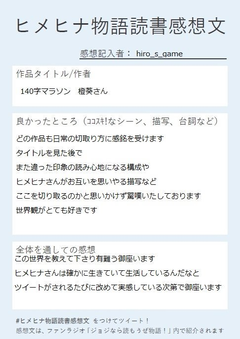
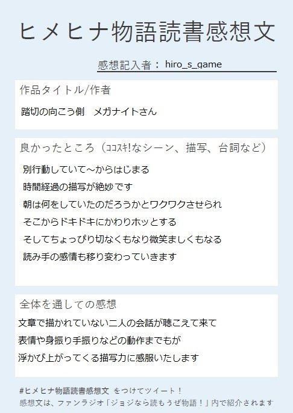
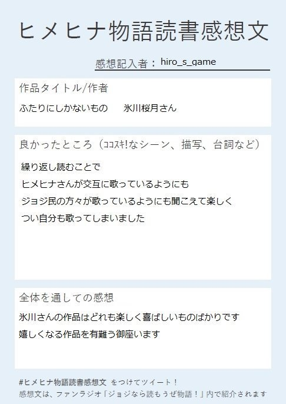
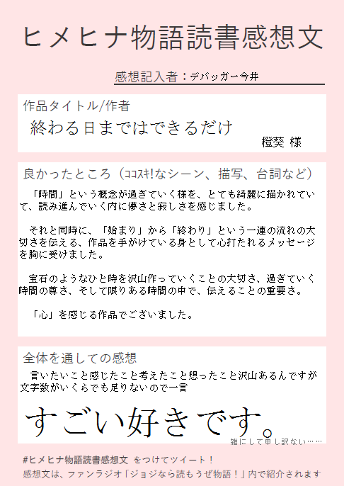
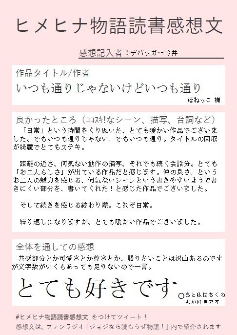
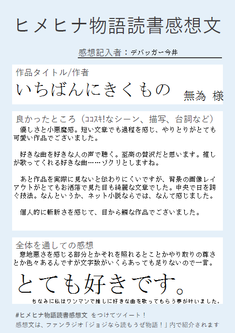
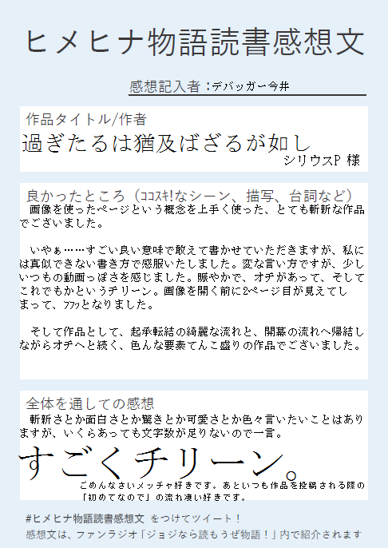

# ジョジなら読もうぜ物語！　第11回放送

放送のアーカイブ（Twicas）は[こちら](https://twitcasting.tv/hmhnstory_radio/movie/572252724)から

## 今日のトピック
1. OPトーク
1. 企画
    1. ヒメヒナ物語読書感想文の発表
    1. 書いてみよう！のコーナー
        - 次回のお題：<b>紅葉（こうよう/もみじ）</b>
    1. 即興140字 お題募集
1. EDトーク

※今回は30分延長して放送いたしました。

次回：第12回 10/21(月) 22:00~ 予定

本ラジオへのご意見・感想は **「#ジョジヨミ」** へ！

---

## もっと詳しく
### 1. OPトーク

本ラジオは、Vtuberのヒメヒナの物語用タグ「ヒメヒナ物語」の知名度向上、さらなる盛り上げを目指すラジオです。  
「ヒメヒナ物語」を読む人・書く人を増やす活動の推進を目的としています。  

台風は過ぎましたが、みなさん状況はいろいろかと思います。  
そのなかで、娯楽の一つとしてヒメヒナ物語が楽しんでいただければと、考えています。  

### 2. 企画
#### ①ヒメヒナ物語読書感想文の発表
9/15~30の間、「ヒメヒナ物語に対する感想をみんなで書こう」ということで、みなさんの「読書感想文」を募集しました。  
詳細は[こちら](../kansou.md)から。

**＜ツイート添付画像のご紹介＞**

感想記入者：hiro_s_game  

|紹介作品：[『140字マラソン』](https://www.pixiv.net/artworks/74200004)|
|---|
||

|紹介作品：[『踏切の向こう側』](https://twitter.com/megaknight427/status/1127568426782748673?s=20)|
|---|
||

|紹介作品：[『ふたりにしかないもの』](https://twitter.com/satsuki_1128/status/1132571612736155648?s=20)|
|---|
||

感想記入者：デバッガー今井

|紹介作品：[『終わる日まではできるだけ』](https://www.pixiv.net/novel/show.php?id=11709176)|
|---|
||

|紹介作品：[『いつも通りじゃないけどいつも通り』](https://twitter.com/Y_shikabane/status/1174310262867783681?s=20)|
|---|
||

|紹介作品：[『いちばんにきくもの』](https://twitter.com/kyoumosakesake_/status/1169582015206707200?s=20)|
|---|
||

|紹介作品：[『過ぎたるは猶及ばざるが如し』](https://twitter.com/takada_p/status/1164325350333009920?s=20)|
|---|
||

**＜Google フォーム回答のご紹介＞**  

感想文記入者 : メガナイト  
**作品タイトル : [『ニンの準備を忘れずに』](https://twitter.com/touki_1513/status/1121617534061408256?s=20)**  
作者 : 橙葵  
良かったところ :  
　頑張るヒメちゃんとそれを理解して共に頑張るヒナちゃん良い…  
全体を通しての感想 :  
　絶対この練習風景見てるんですよ。どこで見たんですか？  
  
感想文記入者 : 山田ヒノ  
**作品タイトル : [『鍵盤上の旋律』](https://twitter.com/Sakaki_Zyo_hh/status/1176885669513220096?s=20)**  
作者 : 坂木譲さん  
良かったところ :  
　この作品のお題が「鍵」なのですが、そこから「鍵盤」につなげるワードセンスがすごく好きです。ピアノを通じて通い合う二人の心が、簡潔にテンポよく描かれており、読みやすい作品になっていると感じました。  
全体を通しての感想 :  
　坂木さんの作品を見ているとわかりますが、表現が丁寧なのはもちろん、知識の引き出しがたくさんある方です。もっと多くの人に、坂木さんの作品を読んでいただきたいです。  
  
感想文記入者 : ほねっこ  
**作品タイトル : [『手袋はまだ押し入れの中に』](https://twitter.com/Sakaki_Zyo_hh/status/1173493541835640832?s=20)**  
作者 : 坂木譲さん  
良かったところ :  
　２つ買ってきたのに半分こしたい気分だったって所がとても可愛かったです  
　特に大きい方を鈴木さんにあげるのも田中さんらしいなと感じました  
全体を通しての感想 :  
　ほんとに可愛いお話でした  
　焼き芋の温かさと手を繋いでいるときのお互いの温かさ、この季節にこちらの心まで温かくなるような気持ちになりました  
  
感想文記入者 : ほねっこ  
**作品タイトル : [『ある梅雨の日』](https://www.pixiv.net/novel/show.php?id=11409650)**  
作者 : デバッカー今井さん  
良かったところ :  
　無意識の内に買っていた肉まん  
　出掛けている事に気づかないのは常に相方が頭にあるんだろうなぁというのが伺えて良かったです  
全体を通しての感想 :  
　こちらの作品、「傘の下の太陽」に続きます  
　こっちは田中さん視点なんで、別の視点から楽しむことが出来ます  
　本当偶然というには運命的で素敵です  
  
感想文記入者 : （無記名回答）  
**作品タイトル : [『字書きのススメ！』](https://www.pixiv.net/novel/show.php?id=10179708)**  
作者 : Gumdrops  
良かったところ :  
　主人公の帝国内散策シーンは、「こんな感じなんだろうな～～」って思える描写で凄く好きです  
　あとはお悩みの描写。もうね、共感の嵐でした。  
全体を通しての感想 :  
　僕の抱く悩みが生々しく表現されていてめちゃくちゃ印象に残る一作でした。  
　僕はこれを読んでからしばらく（良い意味で）期待しないことができました。  
  
感想文記入者 : （無記名回答）  
**作品タイトル : [『「親戚の子」』](https://www.pixiv.net/novel/show.php?id=10036078)**  
作者 : しぇみさん  
良かったところ :  
　ギ　ャ　ル　ゲ　ー　ヒ　メ　ヒ　ナ　最　高　で　す  
全体を通しての感想 :  
　ゲーム化してください  
  
感想文記入者 : （無記名回答）  
**作品タイトル : [『【ヒメヒナ物語】一日に、一年分の幸せを』](https://www.pixiv.net/novel/show.php?id=10036429)**  
作者 : 那須野 昴さん  
良かったところ :  
　二人の掛け合いのテンポがこうして文字に起こされるとこんなにいいもんなんだなぁと思いました。  
　動画をもとにして物語を書くというのはなかなか新鮮で良い試みだと思いました。  
全体を通しての感想 :  
　これからもこんな作品を書いてほしいです  
  
感想文記入者 : ほねっこ  
**作品タイトル : [『プレゼント』](https://twitter.com/haruhinata_hh/status/1126120194034655233?s=20)**  
作者 : 日向陽 様  
良かったところ :  
　鈴木さんからのプレゼントに対して何かの気持ちが込められてるんじゃないかって少し期待してしまう所  
全体を通しての感想 :  
　行為に対して期待してしまう田中さんの気持ちが可愛かったです。ただどこか胸がきつくなる、日向さんの作品のいい所が詰まった作品でした。  
  
感想文記入者 : 橙葵  
**作品タイトル : [『ある梅雨の日』](https://www.pixiv.net/novel/show.php?id=11409650)**  
作者 : デバッガー今井さん  
良かったところ :  
　鈴木さんの視点で描かれる田中さんの姿が、大切な生き物なんだな、と感じられる描写が素敵でした。個人的には「間違い無い、ウチのピンクだ。」が好きです  
全体を通しての感想 :  
　鈴木さんの意識によって視界の広さが変わり、それまで見えていなかったものが見えるようになる、という全体の表現がよかったです。一人称視点のお話だからできる描写だなと感じました。鈴木さんが田中さんの姿を映すときの表現が素敵でした。  
  
感想文記入者 : 橙葵  
**作品タイトル : [『鷹は籠の中で』](https://www.pixiv.net/novel/show.php?id=11471219)**  
作者 : 眠さん  
良かったところ :  
　楽しさMAX仲良し100%の部分と、ハートを抉るようなひやりと冷たい感触の表現が混在していて、その落差に感情を持っていかれました。  
　描写では、「その髪を、吸いたくなった。特に深い理由はないんだけど、顔を埋めて匂いを嗅ぎたい。もっと深いところでそれを感じたい。」のところが好きです。その感情を抱いた後の描写も、心臓に悪い（良い）ですね。  
　自立しようとする鈴木さんの姿に寂しさを覚える田中さんのことを考えると、心臓が締め付けられるようでした。  
全体を通しての感想 :  
　がっしりとボリュームのあるお話ですが、章立てのように割れていてテンポ良く読むことができました。章ごとにハートが揺さぶられて大変でしたが、とても良かったです。また、最後の部分を改ページしているので、一層余韻を感じることができました。素敵なお話でした。
 
 
企画に参加してくださったみなさま、ありがとうございました。  
推し作家・作品をご紹介できた方、まだ読んだことのない作品に出会えた方、書きたかったけれど間に合わなかった方、いろいろいらっしゃると思います。  
「感想を送ることが正義で、送らないことは悪」ということはありませんし、「人によっては感想を必要としていない」ということもあります。  
ですが、誰かの書いた物語を読んで「書いてくれてありがとう」と思ったら、それは伝えても誰にも怒られないんじゃないかなと、ぼく（MC橙葵）は思います。  
またこんな企画ができたらいいなと思います。そのときは、参加していただけますと幸いです。

#### ②書いてみよう！のコーナー
みんなで同じお題（前回放送内で告知）でヒメヒナ物語を書こう！　というコーナーです。  

今回は紹介はお休みでしたので、引き続き物語は募集中です。

次回のお題：**紅葉（こうよう/もみじ）**

書いた作品の公開場所は問いません。ツイートの際に 「#ヒメヒナ物語」「#ジョジヨミ」のタグをつけていただいた方のみ、放送ではご紹介します。  
「タグをつけ忘れてしまった！」という場合には、引用RTまたはリプライでタグを付与してください。  
あとから検索して見つけられるようにしていただければ幸いです。  

#### ③即興140字 お題募集
MCがコメントで募集したお題から一つを選び、放送終了後に即興で140字のヒメヒナ物語を書きます。

今回のお題：[コロッケ](https://twitter.com/hmhnStory_Radio/status/1183389540632813568?s=20)

### 3. EDトーク

30分の延長があったため、ヒメヒナ物語読書感想文は全て放送内でご紹介することができました。  
ご協力いただいたみなさん、ありがとうございます。  

今回の企画を通じて、感想文を送ろうかな、と思う人が増えたならうれしいなと思います。  
また、「書いても反応がない」という理由で筆を折る人が少なくなればと祈っています。  

他、JOJI CLUBの会員限定コンテンツ「ヒメヒナ物語朗読」で紹介されている作品のご紹介もしたいですね。  
また、「書いてみよう！のコーナー」ではお題は単語を使っていますが、写真やMMD画像を使っての作品募集もおもしろいかなと考えています。  
これらはまだアイデアレベルで、実現方法等細かいことは検討中ですが、いつかは実現できたらと思います。  

放送に対するご意見・感想等は、本TwitterアカウントのDM、マシュマロ、「#ジョジヨミ」をつけてのツイートで、いただければと思います。

#### 次回：第12回 10/21(月) 22:00~ 予定

以上、「ジョジなら読もうぜ物語！」第11回の内容でした。

橙葵
